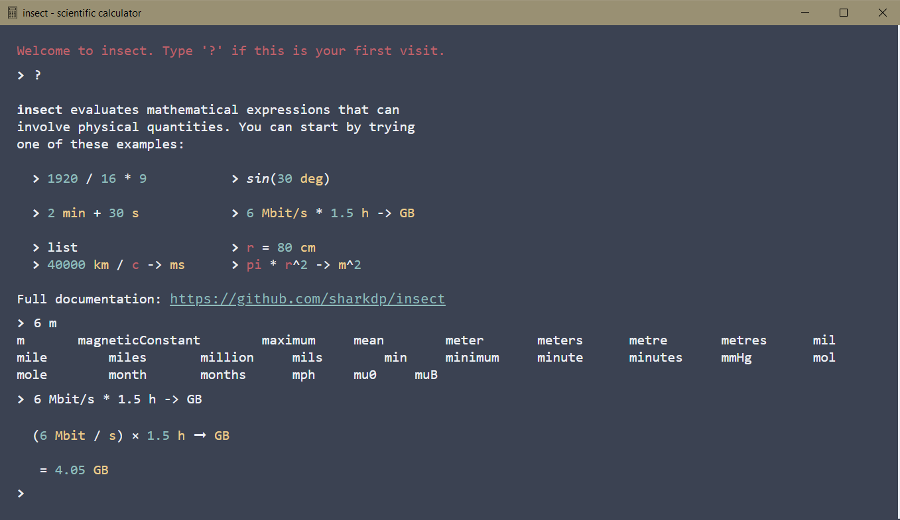

# Native client for insect

See [Insect](https://github.com/sharkdp/insect) for more details.

Bundled with [Neutralinojs](https://github.com/neutralinojs/neutralinojs)

## Installation

Download prebuilt binaries from the [Releases](https://github.com/pcrandall/insect/releases) page.

If you are using windows you can run the installWindows.bat script to install, otherwise extract archive to your `%PATH` location.

**WebViewLoader.dll and res.neu must be located in the same directory as the insect executable**
